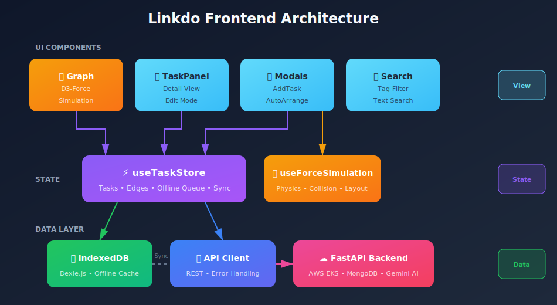

# 🔗 Linkdo Frontend

> **AI 기반 태스크 그래프 관리 시스템의 프론트엔드**

태스크를 노드로, 연관성을 엣지로 표현하여 **그래프 형태로 시각화**하는 태스크 관리 앱입니다.  
D3-Force 물리 시뮬레이션을 활용한 **인터랙티브 그래프**와 **PWA 오프라인 지원**을 제공합니다.

<p align="center">
  
  
  
  
</p>

<br>

## ✨ 주요 기능

### 🕸️ 그래프 기반 태스크 시각화
- **D3-Force 물리 시뮬레이션**: 노드 간 자연스러운 배치와 충돌 감지
- **인터랙티브 그래프**: 드래그, 줌, 팬 지원
- **실시간 연결 관리**: 태스크 간 관계를 시각적으로 연결/해제

### 🤖 AI 기반 스마트 기능
- **PCA 자동정렬**: 임베딩 기반 차원 축소로 유사한 태스크 자동 그룹화
- **AI 태그 추천**: Google Gemini를 활용한 지능형 태그 제안
- **자동 엣지 생성**: 태그 유사도 기반 자동 연결

### 📱 Progressive Web App (PWA)
- **오프라인 지원**: IndexedDB 기반 로컬 캐싱
- **백그라운드 동기화**: 온라인 복구 시 자동 데이터 동기화
- **설치 가능**: 네이티브 앱처럼 홈 화면에 추가

### 🎨 모던 UI/UX
- **다크 테마**: 눈의 피로를 줄이는 세련된 다크 모드
- **미니맵**: 전체 그래프를 한눈에 조망
- **검색 & 필터**: 태그 기반 필터링과 실시간 검색

<br>

## 🛠️ 기술 스택

| 영역 | 기술 |
|------|------|
| **Framework** | React 19 (Concurrent Features) |
| **Language** | TypeScript |
| **Build** | Vite |
| **Graph** | D3-Force (물리 기반 레이아웃) |
| **Offline** | Dexie.js (IndexedDB 래퍼) |
| **PWA** | Vite PWA Plugin |

<br>

## 🏗️ 시스템 아키텍처

<p align="center">
  
</p>

<br>

## 📁 프로젝트 구조

```
src/
├── api/                    # API 클라이언트
│   └── index.ts           # REST API 함수들
├── components/
│   ├── common/            # 공통 UI 컴포넌트
│   │   └── Badge.tsx      # StatusBadge, PriorityBadge
│   ├── Graph/             # 그래프 관련 컴포넌트
│   │   ├── Graph.tsx      # 메인 그래프 캔버스
│   │   ├── GraphNode.tsx  # 노드 렌더링
│   │   ├── GraphEdge.tsx  # 엣지 렌더링
│   │   ├── MiniMap.tsx    # 미니맵
│   │   └── ZoomControls   # 줌 컨트롤
│   ├── modals/            # 모달 컴포넌트
│   │   ├── AddTaskModal   # 태스크 추가/데이터 관리
│   │   └── AutoArrangeModal
│   ├── TaskPanel.tsx      # 태스크 상세 패널
│   ├── SearchBar.tsx      # 검색 바
│   └── DatePicker.tsx     # 날짜 선택기
├── hooks/
│   ├── useTaskStore.ts    # 태스크 상태 관리
│   ├── useForceSimulation.ts  # D3-Force 시뮬레이션
│   └── useOnlineStatus.ts # 온라인 상태 감지
├── db/
│   └── index.ts           # IndexedDB 스키마 (Dexie)
├── types/
│   └── index.ts           # TypeScript 타입 정의
└── styles/
    └── global.css         # 글로벌 스타일
```

<br>

## 🚀 시작하기

### 요구 사항
- Node.js 18+
- npm 또는 yarn

### 설치

```bash
# 저장소 클론
git clone https://github.com/NoTaeGwon/linkdo-frontend.git
cd linkdo-frontend

# 의존성 설치
npm install

# 개발 서버 실행
npm run dev
```

### 빌드

```bash
# 프로덕션 빌드
npm run build

# 빌드 미리보기
npm run preview
```

<br>

## 🔧 핵심 알고리즘

### D3-Force 물리 시뮬레이션

```typescript
// useForceSimulation.ts
const simulation = forceSimulation<TaskNode>(nodes)
  .force('link', forceLink(edges).distance(120))
  .force('charge', forceManyBody().strength(-150))
  .force('collision', forceCollide().radius(40))
  .force('x', forceX().strength(0.02))
  .force('y', forceY().strength(0.02));
```
- 노드 반발력, 링크 거리, 충돌 감지를 조합하여 자연스러운 배치
- Golden Angle 스파이럴로 초기 노드 분산

### 오프라인 우선 아키텍처

```typescript
// useTaskStore.ts
const addTask = async (task: TaskNode) => {
  if (isOnline) {
    await api.createTask(task);     // 서버에 저장
  } else {
    await db.tasks.add(task);       // 로컬에 저장
    await addPendingOperation({...}); // 동기화 큐에 추가
  }
};
```
- IndexedDB에 데이터 캐싱
- 오프라인 작업 큐잉 및 자동 동기화

### PCA 기반 자동정렬
- 백엔드에서 태스크 임베딩 생성
- PCA로 2D 좌표 계산
- StandardScaler로 화면에 맞게 스케일링

<br>

## 📊 데이터 모델

### TaskNode
```typescript
{
  id: string;           // 고유 식별자
  title: string;        // 제목
  description?: string; // 설명
  priority: "low" | "medium" | "high" | "critical";
  status: "todo" | "in-progress" | "done";
  category: string;     // 카테고리
  tags: string[];       // 태그 배열
  dueDate?: string;     // 마감일
  x?: number;           // 그래프 X 좌표
  y?: number;           // 그래프 Y 좌표
}
```

### TaskEdge
```typescript
{
  source: string;  // 시작 태스크 ID
  target: string;  // 끝 태스크 ID
  weight: number;  // 연관도 (0~1)
}
```

<br>

## 🔗 관련 저장소

| 저장소 | 설명 |
|--------|------|
| [linkdo-backend](https://github.com/NoTaeGwon/linkdo-backend) | FastAPI 백엔드 (AI/ML, MongoDB) |

<br>

## 📝 라이선스

MIT License

